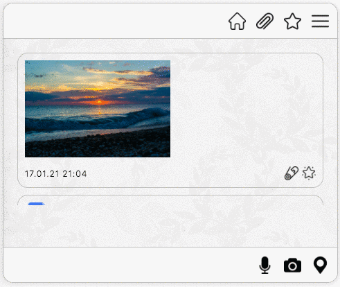

[](https://ci.appveyor.com/project/Vasya24/ahj-diploma/branch/main)

Ссылка на опубликованный [проект](https://Vasya24.github.io/ahj-diploma/).

Cсылка на [сервер](https://github.com/Vasya24/ahj-diploma-server).

Основная задача проекта - создать бота, который предназначен как для хранения информации, так и для поиска и взаимодействия с другими сервисами.
Пользователь закидывает туда всю информацию, которая ему нужна, а бот сортирует, обеспечивает поиск, хранение и отклик.
В качестве прототипов для реализации предлагается взять функциональность Telegram, WhatsApp, Slack или подобных мессенджеров, только вместо живого собеседника будет бот.

##  Реализованные функции:
* Сохранение в истории ссылок и текстовых сообщений
* Ссылки (то, что начинается с http:// или https://) кликабельны и отображаются как ссылки
* Сохранение в истории изображений и файлов - через Drag & Drop и через иконку загрузки


* Скачивание файлов на компьютер пользователя


* Ленивая подгрузка: сначала подгружаются последние 10 сообщений, при прокрутке вверх подгружаются следующие 10 и т.д.


* Запись видео и аудио средствами браузера


* Отправка геолокации (реализована форма добавления координат вручную при отсутствии возможности определить местоположение автоматически)


* Воспроизведение видео/аудио
* Отправка команд боту, например: @chaos: погода, бот отвечает рандомный прогноз погоды (имитация взаимодействия со сторонними сервисами)
* Закрепление (pin) сообщений, сообщение прикрепляется к верхней части страницы (можно прикреплять только одно сообщение)


* Добавление сообщения в избранное (также реализован интерфейс для просмотра избранного)



* Просмотр вложений по категориям, например: аудио, видео, изображения, другие файлы


* Поддержка оформления кода при отправке сообщения в бэктиках
* Отображение пользователю всплывающих подсказок при ошибках, которые могут возникнуть при отсутствии в браузере необходимых инструментов или разрешений на их использование

Для установки зависимостей и запуска проекта локально используются команды:

```sh
$ npm install
$ npm run start
```

Документация собирается при помощи JSDoc:

```sh
$ npm run doc
```
